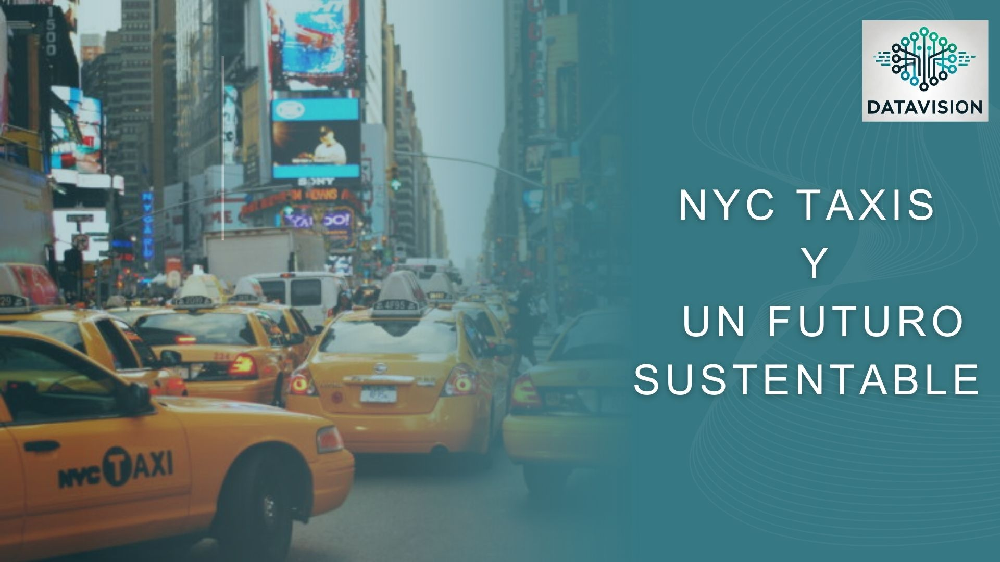
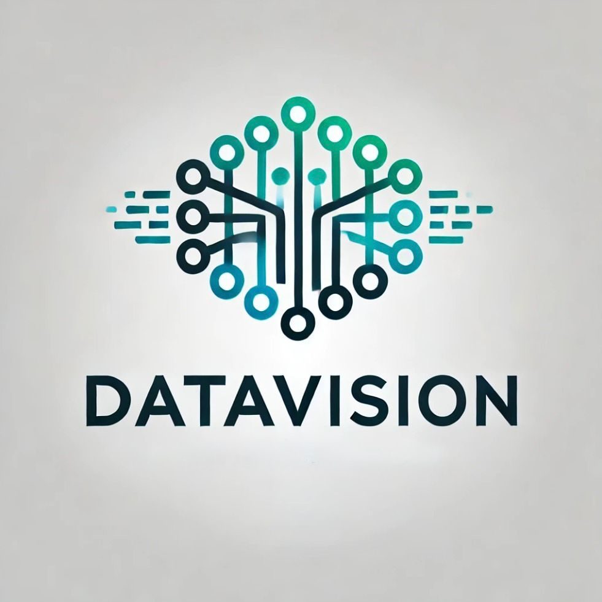
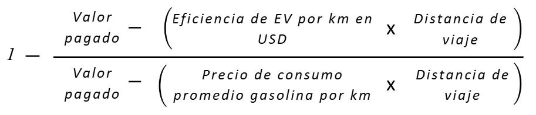
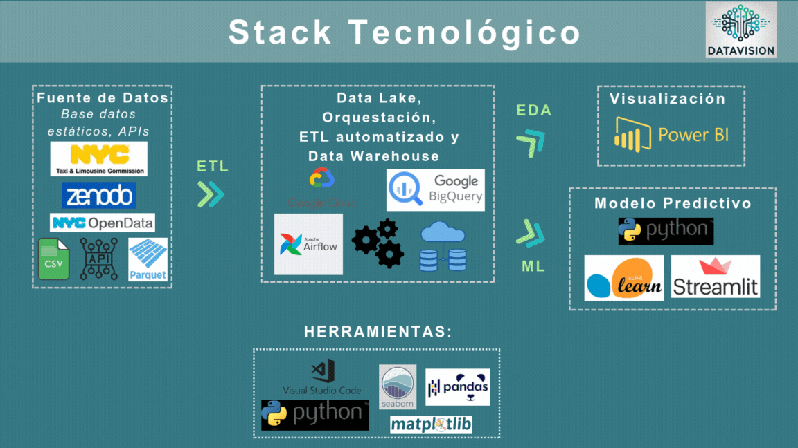
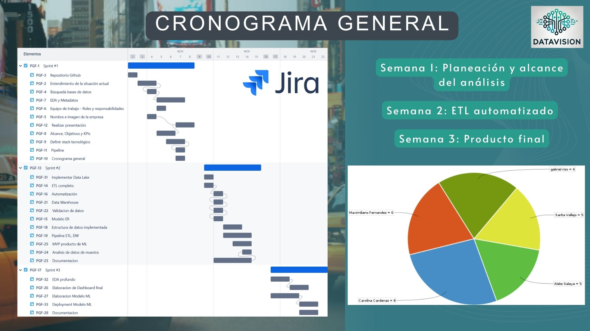

<h1 align='center'>
<b>Análisis de Mercado y Contaminación en NY para Servicio de Taxi</b>
</h1>

  

## Índice

1. [¿Quiénes Somos?](#quiénes-somos)  
2. [Nuestro cliente](#nuestro-cliente)  
3. [Problemática](#problemática)  
4. [Objetivo General](#objetivo-general)  
5. [Nuestra Propuesta](#nuestra-propuesta)  
6. [Objetivos Específicos](#objetivos-específicos)  
7. [KPIs](#kpis)  
8. [Tecnologías](#tecnologías)  
9. [Metodología de trabajo](#metodología-de-trabajo)  
10. [Colaboradores](#colaboradores)  

## ¿Quiénes Somos?

  

Somos una consultora especializada en análisis, ingeniería y ciencia de datos. Nos enfocamos en ser un socio estratégico para nuestros clientes, ayudándoles a alcanzar sus objetivos mediante el aprovechamiento eficiente de los datos. Nuestro propósito es generar un impacto positivo en el desarrollo y crecimiento del entorno empresarial, utilizando los datos para crear información valiosa.

  

## Nuestro cliente
Compañía NYC LIBERTY TRANSPORTATION, empresa dedicada al transporte de pasajeros de media y larga distancia, interesada en diversificar su oferta hacia el sector de transporte en automóviles dentro de áreas urbanas. Con una visión orientada hacia la sostenibilidad, la empresa busca evaluar el impacto ambiental de su potencial flota de vehículos eléctricos en la ciudad de Nueva York. 
Por eso en DataVision realizamos el siguiente análisis preliminar sobre los taxis en NYC para que con este tengan un marco de referencia, puedan tomar decisiones bien fundamentadas y comprendan aún más las tendencias actuales del mercado de transporte.

  

## Problemática
En Nueva York, los servicios de taxis y viajes compartidos como Uber han tenido un aumento del 15% en los ultimos años transformando la movilidad urbana, brindando una opción accesible y conveniente frente al transporte público. Al mismo tiempo, el cambio climático, acelerado por el uso de combustibles fósiles en la generación de energía, ha impulsado a las empresas a tomar medidas más sostenibles, adoptando tecnologías y prácticas para reducir su impacto ambiental, con el fin de mejorar la eficiencia energética y promover un consumo más responsable.

## Objetivo General
DataVision colaborará con el cliente en la construcción de un análisis integral sobre el impacto ambiental del servicio en transporte de taxis en Nueva York. Este proyecto se centrará en la recolección, procesamiento y análisis de los datos provenientes de servicio de taxis, además de incluir datos ambientales como la calidad del aire y la contaminación sonora. 
A través del análisis de estos datos, se obtendrá un marco de referencia detallado sobre el impacto de los taxis en la contaminación ambiental, esto permitirá a nuestro cliente tomar decisiones fundamentadas sobre la posible implementación de vehículos eléctricos en su flota, evaluando tanto los beneficios ambientales como la viabilidad económica.

## Nuestra Propuesta
- Elaboración de un modelo predictivo de viajes en el primer año de operación.
- Análisis del mercado de transporte de pasajeros en automóviles en la ciudad de Nueva York durante el último año.
- Dashboard interactivo con los resultados del análisis.

## Objetivos Específicos
- Lograr una reducción del 10% en las emisiones de CO₂ en comparación con el semestre anterior. Este objetivo estará respaldado por el seguimiento continuo de los indicadores de rendimiento (KPIs) de CO₂, los cuales permitirán evaluar el impacto de las acciones implementadas y realizar ajustes según sea necesario. La meta es contribuir de forma significativa a la reducción de la huella de carbono, alineándose con los compromisos ambientales y sostenibles de la empresa.

- Reducir la contaminación sonora causada por el ruido de motores en un 15% con respecto al año anterior, fomentando el uso de vehículos con menor impacto acústico. Este objetivo estará apoyado en un monitoreo continuo de la Presencia de Ruido Motor a través de los indicadores de rendimiento (KPIs) específicos, permitiendo realizar ajustes en las estrategias y evaluar la efectividad de las acciones implementadas en la mejora de la calidad sonora de la ciudad.

- Incrementar en un 30% las ganancias diarias por viajes mediante la implementación de vehículos eléctricos en comparación con los vehículos convencionales. Este objetivo se centra en optimizar la rentabilidad del servicio de transporte al reducir los costos operativos asociados al combustible, aprovechando la mayor eficiencia y el menor costo de operación de los vehículos eléctricos. El impacto de esta transición se evaluará a través de KPIs específicos de ganancias diarias y costos de operación, ajustando las estrategias según los resultados.

- Lograr una rentabilidad mínima de 2 USD por cada kilómetro recorrido durante el primer año, basada en el ingreso generado por cada pasajero transportado. Este objetivo busca asegurar que cada kilómetro recorrido sea rentable, optimizando la relación entre costos operativos y el ingreso obtenido por pasajero. Se monitoreará con  indicadores clave de rendimiento (KPIs) que abarca ingresos, distancia y número de pasajeros, permitiendo ajustes continuos para alcanzar y superar el objetivo de rentabilidad.

## KPIs
En línea con los objetivos, se establecen una serie de KPIs que servirán como indicadores de rendimiento para evaluar el cumplimiento de las metas propuestas:

- Sabiendo que la problemática principal de nuestro cliente es la contaminación, se crea este KPI que evalúa la reducción de emisiones de CO2 en comparación con el semestre anterior.

$$
Reducción CO_2 = ((CO_2 Semestre Anterior - CO_2 Semestre Actual) / CO_2 Semestre Anterior) * 100
$$

- Además, no solo estamos en presencia de un tipo único de polución, la contaminación sonora ha generado un gran impacto en la ciudad de NY a lo largo de los años, por ende, se crea este KPI que evalúa la reducción de la contaminación sonora respecto al año anterior.

$$
Reducción Contaminación Sonora = ((Aporte Motores Año Anterior - Aporte Motores Año Actual) / Aporte Motores Año Anterior) * 100
$$

- Adicionalmente, como en cualquier negocio, se debe tener en cuenta el factor económico, por ende se crea este KPI que evalua las ganancias diarias por viajes mediante la implementación de vehículos eléctricos en comparación con los vehículos convencionales.

  

- Finalmente, se debe chequear la eficiencia del factor operacional, para esto se crea este KPI que evalua la rentabilidad mínima de 2 USD por cada kilómetro recorrido durante el primer año, basada en el ingreso generado por cada pasajero transportado.

$$
Ingreso Por: Pasajero-Kilómetro = (Valor Pagado) / (Número De Pasajeros * Distancia De Viaje)
$$

## Tecnologías

  

## Metodología de trabajo
Para la gestión del proyecto, Scrum es un marco ágil que permite a equipos diversos trabajar juntos para resolver problemas complejos y entregar valor continuo. Sin jerarquías, el equipo es una unidad ágil y adaptable que ajusta su enfoque según los cambios para satisfacer mejor las necesidades del cliente. Basado en los valores de compromiso, enfoque, apertura, respeto y coraje, Scrum fomenta la colaboración y la responsabilidad compartida. Así, el equipo se convierte en un motor de innovación y entrega constante, alineado con los objetivos y expectativas del cliente.

  

## Colaboradores

### *Sarita Vallejo*

### *Gabriel Rizo*

### *Carolina Cárdenas*

### *Aleks Salaya*

### *Maximiliano Fernandez*

